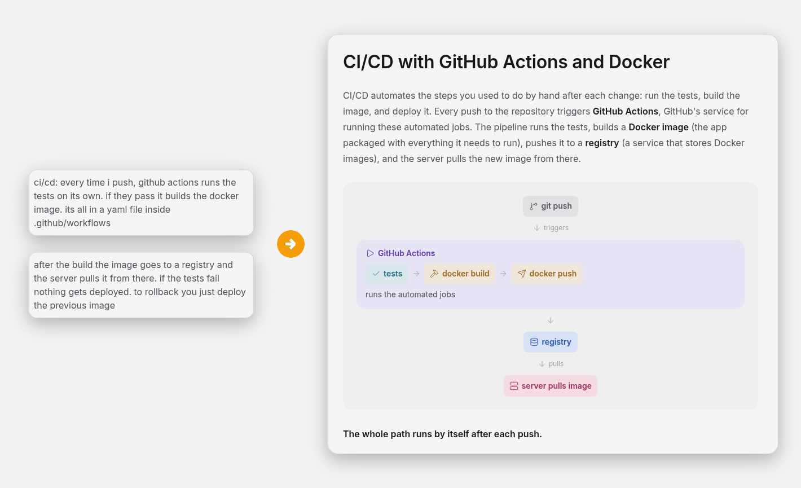
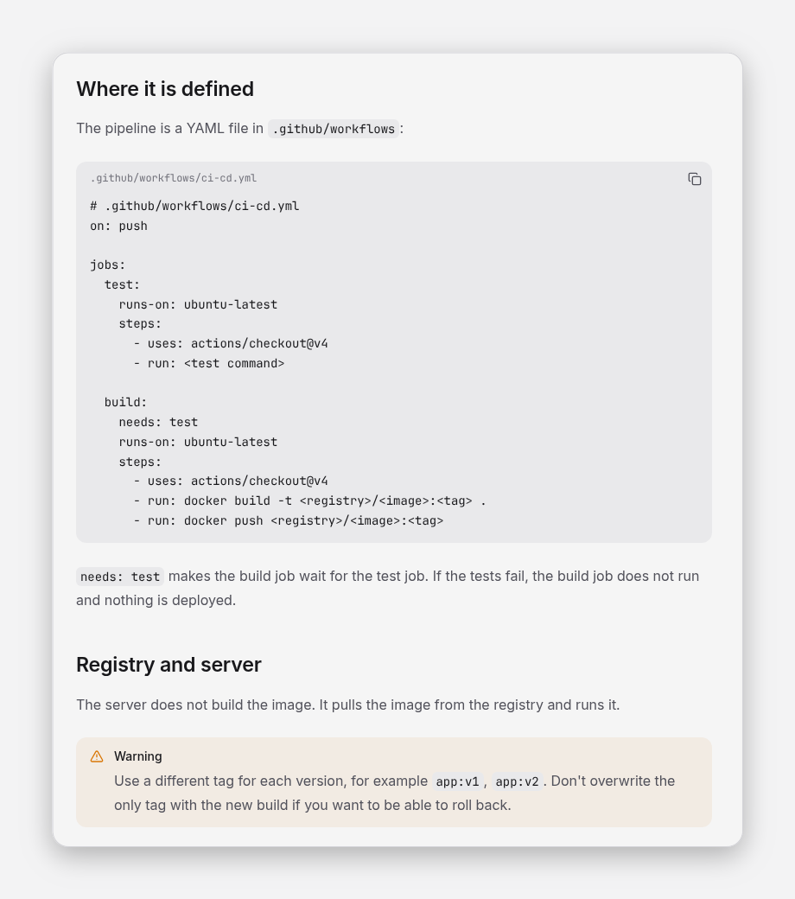

<p align="center">
  
</p>

<h1 align="center">Kolmi</h1>

<p align="center">
  <strong>Kolmi is a notebook a whole class writes together: everyone drops their notes, and an AI turns them into organized pages with diagrams, charts and interactive pieces.</strong>
</p>

<p align="center">
  For one class, self-hosted.
</p>

<p align="center">
  <a href="docs/idea.md"></a>
  <a href="LICENSE"></a>
</p>

<p align="center">
  <a href="#run-it-locally">Run locally</a> ·
  <a href="README.es.md">Español</a>
</p>

<p align="center">
  
</p>

<p align="center"><sub>Two loose notes in, one page out. This one is a real run of the nightly pass.</sub></p>

## What is Kolmi?

In a class, everyone takes their own notes, and nobody has the whole notebook. Kolmi makes one,
together.

Everyone drops what they have, in their own words and in no particular format. At night the hive
works: an AI reads what is new, joins what belongs together and writes the class's pages. Each
page is laid out like a good study guide, with a diagram where an idea has parts, a chart where
numbers matter and small interactive pieces to try things out.

> Everyone adds a drop; the class ends up with honeycomb.

Kolmi is for one class. Each class runs its own copy, with its own data.

## How it works

A team of agents runs once a day. The gatekeeper reads each new note, strips names and private
data, discards what adds nothing and decides which page it belongs to. The notes agent writes
what the gatekeeper lets through, and the web agent lays it out as a page.

| | Raw note | Shared page |
|---|---|---|
| Who sees it | its author and the admins, until the pass takes it | the whole class |
| What it looks like | free text and files | organized, with diagrams, tables, charts and interactive pieces |
| Names and private data | whatever you wrote | stripped |

Raw notes never go out. Only the summary does.

## What you can do today

**As a student**

- **Drop a note** in free text, with files attached, whenever you have something to add.
- **Read the class's pages**: diagrams, charts, tables, step-by-step replays of agent sessions
  and interactive pieces.
- **Find your way** with the content tree, a table of contents and links to the previous and
  next page.
- **Check the class timetable.**
- **Take a short tour** the first time you sign in.
- **Take the notebook with you**: download a section's pages as Markdown files, to keep or to
  upload to NotebookLM.

**As an admin**

- **Run the nightly pass** on a schedule, or on demand with "Run now".
- **Check what the AI did** in the AI log: what it read, what it changed and the notes it worked
  from.
- **Organize the tree** by hand: create, rename, move, reorder and delete.
- **Set the class's timetable and language**, Spanish or English.

<p align="center">
  
</p>

<p align="center"><sub>A page can hold more than text: diagrams, code you can copy, numbered steps.</sub></p>

## Run it locally

You need Python 3, Node 20 or higher, a Supabase project and an API key for a model.

```bash
# backend, on :8000
cd backend
python3 -m venv .venv && source .venv/bin/activate
pip install -r requirements-dev.txt
cp .env.example .env    # Supabase, CLASS_CODE and the model keys
uvicorn app.main:app --reload

# frontend, on :5173
cd frontend
npm install
cp .env.example .env
npm run dev
```

Create the tables first with [supabase/schema.sql](supabase/schema.sql). The `.env` files stay
out of git. Each class runs its own instance, and the backend ships as a Docker image: build, run
and the cron for the pass are in [backend/README.md](backend/README.md).

> **Status: in development.** Next come "Ask the hive", a chat with the notes, and forums. See
> [ROADMAP.md](ROADMAP.md).

## Documentation

- [The idea](docs/idea.md): the problem, the team of agents and why raw notes stay private.
- [Authentication and users](docs/authentication.md): accounts, roles and the class code.
- [Features and actions](docs/features.md): what the app does and how each action is built.
- [Page format](docs/page-format.md): how a page goes from the pass to the screen.
- [Testing with real cases](docs/testing.md): the plan for trying it before the class does.
- [Data and privacy](docs/privacy.md): what is stored, who sees it and what leaves the instance.
- [Brand tone](docs/brand-tone.md): how Kolmi sounds.
- [Brand visuals](docs/brand-visuals.md): how to make an image that looks like Kolmi.

## Ecosystem

- [elastic-ui](https://github.com/JoseEstevez520/elastic-ui) is the component library the web
  is built with.
- [ies-teis-daw2](https://github.com/JoseEstevez520/ies-teis-daw2) is the class repository,
  with its tools and the material the first pages grew from.

## License

Kolmi is open source under the [MIT license](LICENSE). Security issues should follow
[SECURITY.md](SECURITY.md), never a public issue.
