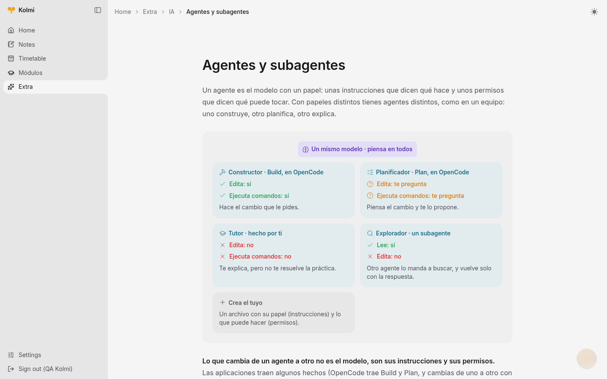
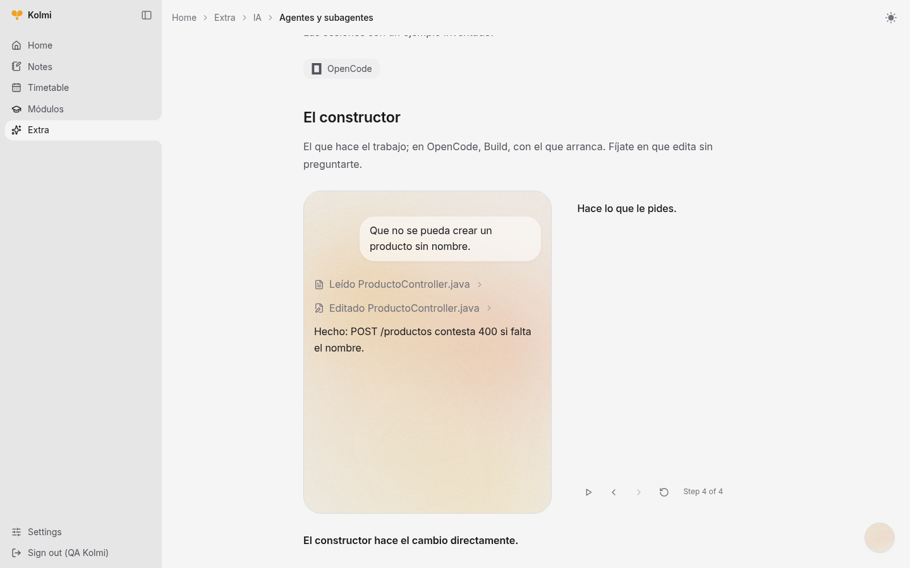
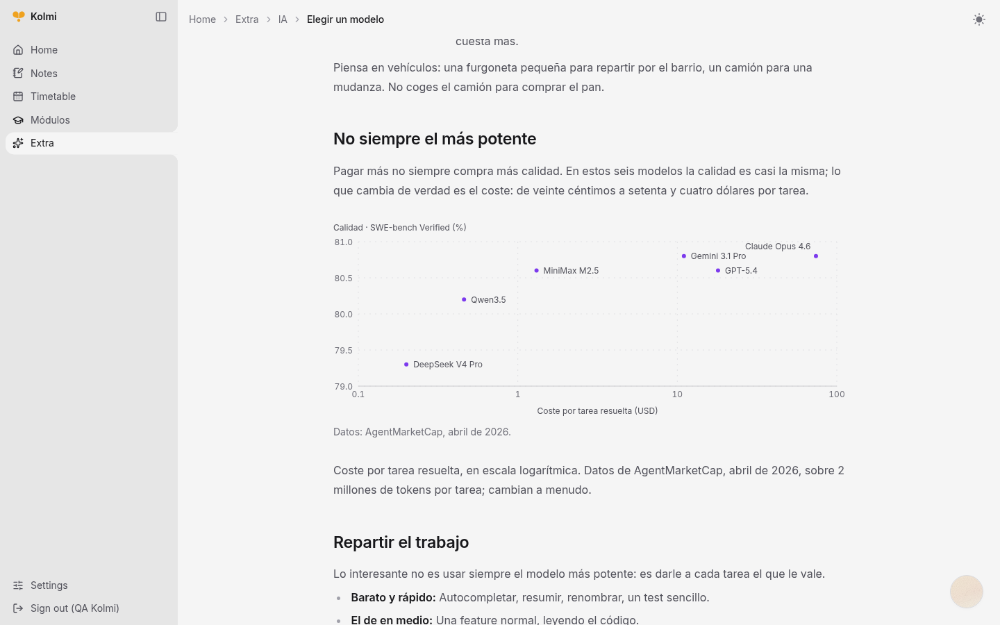
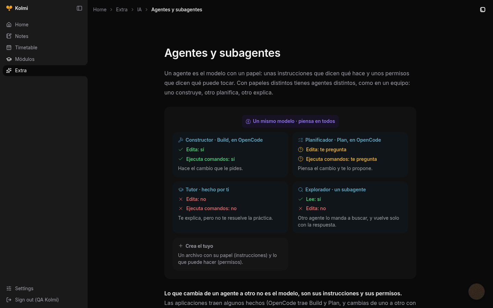
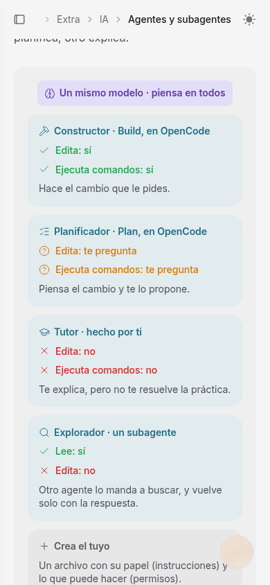

<p align="center">
  
</p>

<h1 align="center">Kolmi</h1>

<p align="center"><strong>Learn as a hive.</strong></p>

Kolmi is a collaboration app for a class. Everyone contributes a little (a note, a doubt, an
answer) and the AI turns it into shared notes. No one has to learn git or a framework to
take part.

<p align="center">
  
</p>

<p align="center"><sub>A page the hive wrote. The diagram is part of the page, not an image. This instance writes in Spanish.</sub></p>

## The thesis

Learning is social. People learn by asking, explaining and building on each other's ideas,
not alone. Vygotsky called it **social constructivism**: knowledge is co-constructed. Kolmi
is a hive for that.

> Everyone adds a drop; the class ends up with honeycomb.

## How it works

```
raw notes  ->  nightly pass  ->  shared pages
(private)      (agents)          (the whole class)
```

1. Students log in and leave raw notes, with files if they have them.
2. Once a day a team of agents reads the new notes, groups them by topic and strips names
   and private data.
3. They write the result into the content tree as shared notes and pages, in the class's
   language.

Raw notes stay private. Only the summary goes out. An admin can read what each pass did in
the AI log.

More ways to contribute are coming: a chat with the notes, forums, whatever the class needs.
See [ROADMAP.md](ROADMAP.md).

## Screenshots

A page can hold more than text: diagrams, charts, terminal sessions and agent replays that
you step through.

<table>
  <tr>
    <td width="50%"></td>
    <td width="50%"></td>
  </tr>
  <tr>
    <td align="center"><sub>An agent session you can play or step through.</sub></td>
    <td align="center"><sub>A chart with real axes, drawn from the data in the page.</sub></td>
  </tr>
  <tr>
    <td width="50%"></td>
    <td width="50%" align="center"></td>
  </tr>
  <tr>
    <td align="center"><sub>Dark mode.</sub></td>
    <td align="center"><sub>On a phone the diagram stacks into one column.</sub></td>
  </tr>
</table>

## Self-hosting

Kolmi is self-hostable: each class runs its own instance (a small server and a Supabase
project). Nothing is shared between classes. The backend ships as a Docker image; build, run
and the cron that runs the pass are in [backend/README.md](backend/README.md).

To try it locally you need Python 3, Node 20 or higher, a Supabase project and an API key for
a model:

```bash
# backend, on :8000
cd backend
python3 -m venv .venv && source .venv/bin/activate
pip install -r requirements-dev.txt
cp .env.example .env    # Supabase, CLASS_CODE and the model keys
uvicorn app.main:app --reload

# frontend, on :5173
cd frontend
npm install
cp .env.example .env
npm run dev
```

Create the tables first with [supabase/schema.sql](supabase/schema.sql). The `.env` files stay
out of git.

## Status

In development. Login, notes with files, the content tree, the admin panel with the AI log,
the class timetable and the pass all work. DeepSeek writes the pages in OpenUI Lang, in the
class's language (Spanish and English for now).

## Docs

- [The idea](docs/idea.md)
- [Authentication and users](docs/authentication.md)
- [Features and actions](docs/features.md)
- [Page format](docs/page-format.md)
- [Testing with real cases](docs/testing.md)
- [Data and privacy](docs/privacy.md)
- [Brand tone](docs/brand-tone.md)

## Structure

```
backend/   - Python + FastAPI API
frontend/  - Vue 3 + Vite web
docs/      - the idea, specs and brand tone
assets/    - logo and other resources
```

## License

MIT. See [LICENSE](LICENSE).
