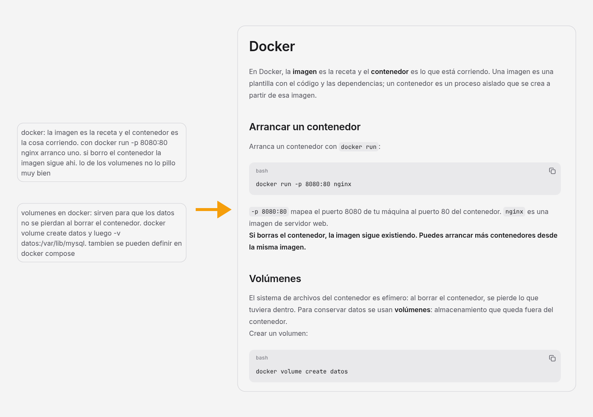

<p align="center">
  
</p>

<h1 align="center">Kolmi</h1>

<p align="center">
  <strong>Kolmi turns each student's loose notes into shared pages, ordered and visual, without anyone touching git.</strong>
</p>

<p align="center">
  For one class, self-hosted.
</p>

<p align="center">
  <a href="docs/idea.md"></a>
  <a href="LICENSE"></a>
</p>

<p align="center">
  <a href="#run-it-locally">Run locally</a> ·
  <a href="README.es.md">Español</a>
</p>

<p align="center">
  
</p>

<p align="center"><sub>Two loose notes in, one page out. This one is a real run of the nightly pass.</sub></p>

## What is Kolmi?

A class knows a lot, and most of it stays in each person's notebook. Sharing it by hand means
knowing git and a framework, so most people don't, even when they have something to say.

Kolmi removes that step. Everyone leaves their notes in free text, with no format. Once a day
the app reads the new ones, joins those about the same topic and writes the shared pages the
whole class reads, with diagrams, tables and charts instead of a pile of text.

> Everyone adds a drop; the class ends up with honeycomb.

## How it works

A team of agents runs once a day. The gatekeeper reads each new note, strips names and private
data, discards what adds nothing and decides which page it belongs to. The notes agent writes
what the gatekeeper lets through, and the web agent turns it into a page.

| | Raw note | Shared page |
|---|---|---|
| Who sees it | its author and the admins, until the pass takes it | the whole class |
| What it looks like | free text and files | ordered, with diagrams, tables and charts |
| Names and private data | whatever you wrote | stripped |

Raw notes never go out. Only the summary does.

## What you can do today

- **Leave notes** in free text, with files attached.
- **Read the shared pages**, which can hold diagrams, tables, charts and replays of agent
  sessions.
- **Browse the class's content tree**, with breadcrumbs, a table of contents and links to the
  previous and next page.
- **Run the nightly pass** on a schedule, or on demand with "Run now" in Admin.
- **Check what the AI did** in the AI log: what it read, what it changed and the notes it worked
  from.
- **Edit the tree** by hand in Admin: create, rename, move, reorder and delete.
- **Set the class's timetable and language**, Spanish or English.

## Run it locally

You need Python 3, Node 20 or higher, a Supabase project and an API key for a model.

```bash
# backend, on :8000
cd backend
python3 -m venv .venv && source .venv/bin/activate
pip install -r requirements-dev.txt
cp .env.example .env    # Supabase, CLASS_CODE and the model keys
uvicorn app.main:app --reload

# frontend, on :5173
cd frontend
npm install
cp .env.example .env
npm run dev
```

Create the tables first with [supabase/schema.sql](supabase/schema.sql). The `.env` files stay
out of git. Each class runs its own instance, and the backend ships as a Docker image: build, run
and the cron for the pass are in [backend/README.md](backend/README.md).

> **Status: in development.** Next come a chat with the notes and forums. See
> [ROADMAP.md](ROADMAP.md).

## Documentation

- [The idea](docs/idea.md): the problem, the team of agents and why raw notes stay private.
- [Authentication and users](docs/authentication.md): accounts, roles and the class code.
- [Features and actions](docs/features.md): what the app does and how each action is built.
- [Page format](docs/page-format.md): how a page goes from the pass to the screen.
- [Testing with real cases](docs/testing.md): the plan for trying it before the class does.
- [Data and privacy](docs/privacy.md): what is stored, who sees it and what leaves the instance.
- [Brand tone](docs/brand-tone.md): how Kolmi sounds.

## Ecosystem

- [elastic-ui](https://github.com/JoseEstevez520/elastic-ui) is the component library the web
  is built with.
- [ies-teis-daw2](https://github.com/JoseEstevez520/ies-teis-daw2) holds the class's own
  material. Kolmi doesn't need it to run.

## License

Kolmi is open source under the [MIT license](LICENSE). Security issues should follow
[SECURITY.md](SECURITY.md), never a public issue.
