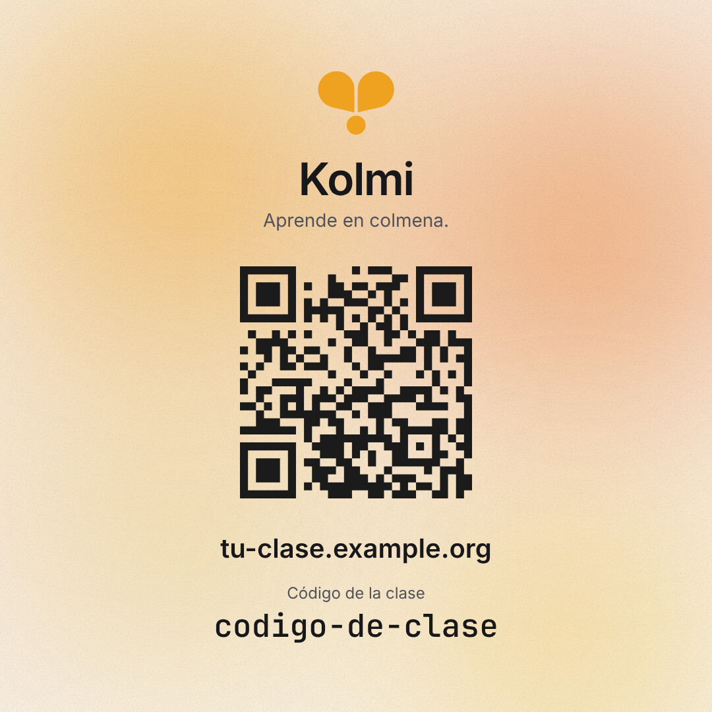

# Brand visuals

How to make an image for Kolmi (a poster, a handout, a card for the class chat) so that it looks
like it came out of the app. [Brand tone](brand-tone.md) says how Kolmi talks; this says how it
looks. It comes from the first handout, the class invitation, and from two versions of it that
were thrown away.

<p align="center">
  
</p>

<p align="center"><sub>The invitation, with made-up data. The link and the code are not real.</sub></p>

## The rule

Treat an image as a screen of the app. Build it from the library's parts, the app's own texts
and the app's tokens. A layout styled by hand reads as generic even when each
piece looks fine, and the class notices.

Everything in [frontend/design.md](../frontend/design.md) applies:

- **Grey by default.** There is no accent colour. Colour only carries meaning.
- **No shadows of our own**, no borders added to the library's parts.
- **One thing decorative at most.** The Aurora, in honey, is the library's only decoration and
  the app's only warm colour. Use it once.
- **One width, one column.** Centre what belongs together.

## What an image is made of

| Piece | Where it comes from |
|---|---|
| Logo | `assets/logo.svg`, honey `#EFA220`, never recoloured |
| Type | Inter for text, the library's monospace for codes, sizes from the library's scale |
| Colours | The library's tokens (`text-fg`, `text-fg-secondary`) and the honey `--aurora-1` to `--aurora-4` in `frontend/src/style.css` |
| Background | The library's `Aurora`, filling the whole image |
| Words | The app's own texts in `frontend/src/locales`, in the class's language |

Take the words from the app rather than writing new ones. "Aprende en colmena." and "Código de
la clase" are already there, and a person who saw them in the app will recognise them.

## The invitation

A square. The Aurora fills all of it, and one centred column goes on top, with no card and no
second surface:

1. The logo, 60 px.
2. "Kolmi" at 34 px, semibold, tight tracking, and the slogan under it in `text-sm`, secondary.
3. The QR code, 176 px, with no white tile behind it. It is dark on a pale gradient and still
   reads.
4. The link, `text-xl` semibold.
5. The label "Código de la clase" in `text-xs`, secondary, and the code in monospace, `text-2xl`
   semibold.

```vue
<script setup>
import { Aurora } from 'elastic-ui'
import qr from './qr.svg?raw'
</script>

<template>
  <Aurora class="flex size-[540px] flex-col items-center justify-center gap-6 text-center">
    <div class="flex flex-col items-center gap-3">
      
      <div class="flex flex-col gap-1">
        <h1 class="text-[34px] leading-none font-semibold tracking-tight text-fg">Kolmi</h1>
        <p class="text-sm text-fg-secondary">Aprende en colmena.</p>
      </div>
    </div>

    <div class="[&_svg]:block [&_svg]:size-[176px]" v-html="qr" />

    <div class="flex flex-col items-center gap-3">
      <p class="text-xl font-semibold text-fg">tu-clase.example.org</p>
      <div class="flex flex-col items-center gap-0.5">
        <p class="text-xs text-fg-secondary">Código de la clase</p>
        <p class="font-mono text-2xl font-semibold text-fg">codigo-de-clase</p>
      </div>
    </div>
  </Aurora>
</template>
```

## Build it

Do it in a scratch folder outside the repo, so nothing real ends up in git.

1. A small Vite project with the Vue and Tailwind plugins, the same two as
   `frontend/vite.config.js`.
2. A `node_modules` that is a symlink to `frontend/node_modules`, so the project uses the
   library the app uses.
3. A `src/style.css` that is the top of `frontend/src/style.css`, up to its `body` rule, so it
   carries the tokens and the honey aurora colours. Set the body margin to 0.
4. `src/main.js`: `createApp(Invite).use(ElasticUi).mount('#app')`, with the stylesheet imported.
5. `public/logo.svg`: a copy of `assets/logo.svg`.
6. The QR code as an inline SVG, made with `segno` (pure Python):

   ```python
   import segno
   q = segno.make("https://tu-clase.example.org", error="m")
   open("src/qr.svg", "w").write(
       q.svg_inline(scale=1, border=0, dark="#1b1b1b", light=None, omitsize=True)
   )
   ```

7. Render it with Playwright and Chromium: a 540 by 540 viewport, `deviceScaleFactor` 4 for a
   2160 px image (2 for one that goes in the repo), and about three seconds of waiting so the
   Aurora has settled. Its lights drift, so each render is a little different. If the logo
   lands on a dark patch, render again.

## Check it

- **Decode the QR in the final image**, not in the source. `jsQR` on the PNG is enough. A code
  that looks right and does not scan is the usual failure.
- **Read the words out loud.** Each one should be a text that is already in the app.
- **Look for anything that is not the library's:** a colour, a shadow, a border, a second
  background. Take it out.

## What the first version got wrong

Keep this list. Each item is a habit that comes back:

- A warm gradient on the page, when the Aurora is the only gradient the app has.
- Soft shadows under a white card.
- A dark box for the code and orange circles on the steps, which are colours with no meaning.
- A grey `Card` on a grey page, and later an Aurora panel on a white page: two surfaces where
  one was enough.

## Keep the data out of the repo

The real link and the real class code go in the image and in the message you send, never in a
file in this repo. The example above uses `example.org` on purpose. Keep the finished image
somewhere outside the repo, like a folder on your desktop.
